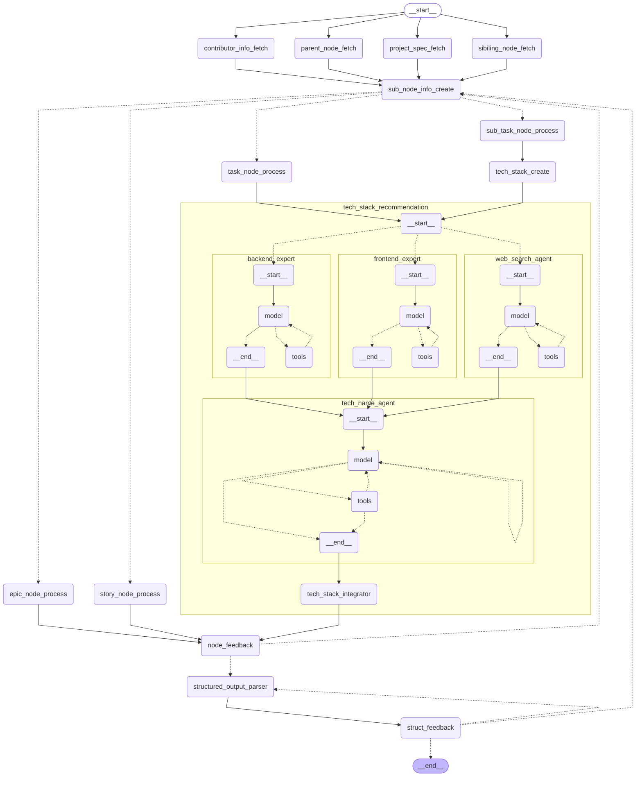

```mermaid

---
config:
  flowchart:
    curve: linear
---
graph TD;
	__start__([<p>__start__</p>]):::first
	parent_node_fetch(parent_node_fetch)
	project_spec_fetch(project_spec_fetch)
	contributor_info_fetch(contributor_info_fetch)
	epic_node_process(epic_node_process)
	story_node_process(story_node_process)
	sub_node_info_create(sub_node_info_create)
	task_node_process(task_node_process)
	sub_task_node_process(sub_task_node_process)
	tech_stack_create(tech_stack_create)
	structured_output_parser(structured_output_parser)
	node_feedback(node_feedback)
	struct_feedback(struct_feedback)
	sibiling_node_fetch(sibiling_node_fetch)
	__end__([<p>__end__</p>]):::last
	__start__ --> contributor_info_fetch;
	__start__ --> parent_node_fetch;
	__start__ --> project_spec_fetch;
	__start__ --> sibiling_node_fetch;
	contributor_info_fetch --> sub_node_info_create;
	epic_node_process --> node_feedback;
	node_feedback -.-> structured_output_parser;
	node_feedback -.-> sub_node_info_create;
	parent_node_fetch --> sub_node_info_create;
	project_spec_fetch --> sub_node_info_create;
	sibiling_node_fetch --> sub_node_info_create;
	story_node_process --> node_feedback;
	struct_feedback -.-> __end__;
	struct_feedback -.-> structured_output_parser;
	struct_feedback -.-> sub_node_info_create;
	structured_output_parser --> struct_feedback;
	sub_node_info_create -.-> epic_node_process;
	sub_node_info_create -.-> story_node_process;
	sub_node_info_create -.-> sub_task_node_process;
	sub_node_info_create -.-> task_node_process;
	sub_task_node_process --> tech_stack_create;
	task_node_process --> tech_stack_recommendation\3a__start__;
	tech_stack_create --> tech_stack_recommendation\3a__start__;
	tech_stack_recommendation\3atech_stack_integrator --> node_feedback;
	subgraph tech_stack_recommendation
	tech_stack_recommendation\3a__start__(<p>__start__</p>)
	tech_stack_recommendation\3atech_stack_integrator(tech_stack_integrator)
	tech_stack_recommendation\3a__start__ -.-> tech_stack_recommendation\3abackend_expert\3a__start__;
	tech_stack_recommendation\3a__start__ -.-> tech_stack_recommendation\3afrontend_expert\3a__start__;
	tech_stack_recommendation\3a__start__ -.-> tech_stack_recommendation\3aweb_search_agent\3a__start__;
	tech_stack_recommendation\3abackend_expert\3a__end__ --> tech_stack_recommendation\3atech_name_agent\3a__start__;
	tech_stack_recommendation\3afrontend_expert\3a__end__ --> tech_stack_recommendation\3atech_name_agent\3a__start__;
	tech_stack_recommendation\3atech_name_agent\3a__end__ --> tech_stack_recommendation\3atech_stack_integrator;
	tech_stack_recommendation\3aweb_search_agent\3a__end__ --> tech_stack_recommendation\3atech_name_agent\3a__start__;
	subgraph frontend_expert
	tech_stack_recommendation\3afrontend_expert\3a__start__(<p>__start__</p>)
	tech_stack_recommendation\3afrontend_expert\3amodel(model)
	tech_stack_recommendation\3afrontend_expert\3atools(tools)
	tech_stack_recommendation\3afrontend_expert\3a__end__(<p>__end__</p>)
	tech_stack_recommendation\3afrontend_expert\3a__start__ --> tech_stack_recommendation\3afrontend_expert\3amodel;
	tech_stack_recommendation\3afrontend_expert\3amodel -.-> tech_stack_recommendation\3afrontend_expert\3a__end__;
	tech_stack_recommendation\3afrontend_expert\3amodel -.-> tech_stack_recommendation\3afrontend_expert\3atools;
	tech_stack_recommendation\3afrontend_expert\3atools -.-> tech_stack_recommendation\3afrontend_expert\3amodel;
	end
	subgraph backend_expert
	tech_stack_recommendation\3abackend_expert\3a__start__(<p>__start__</p>)
	tech_stack_recommendation\3abackend_expert\3amodel(model)
	tech_stack_recommendation\3abackend_expert\3atools(tools)
	tech_stack_recommendation\3abackend_expert\3a__end__(<p>__end__</p>)
	tech_stack_recommendation\3abackend_expert\3a__start__ --> tech_stack_recommendation\3abackend_expert\3amodel;
	tech_stack_recommendation\3abackend_expert\3amodel -.-> tech_stack_recommendation\3abackend_expert\3a__end__;
	tech_stack_recommendation\3abackend_expert\3amodel -.-> tech_stack_recommendation\3abackend_expert\3atools;
	tech_stack_recommendation\3abackend_expert\3atools -.-> tech_stack_recommendation\3abackend_expert\3amodel;
	end
	subgraph web_search_agent
	tech_stack_recommendation\3aweb_search_agent\3a__start__(<p>__start__</p>)
	tech_stack_recommendation\3aweb_search_agent\3amodel(model)
	tech_stack_recommendation\3aweb_search_agent\3atools(tools)
	tech_stack_recommendation\3aweb_search_agent\3a__end__(<p>__end__</p>)
	tech_stack_recommendation\3aweb_search_agent\3a__start__ --> tech_stack_recommendation\3aweb_search_agent\3amodel;
	tech_stack_recommendation\3aweb_search_agent\3amodel -.-> tech_stack_recommendation\3aweb_search_agent\3a__end__;
	tech_stack_recommendation\3aweb_search_agent\3amodel -.-> tech_stack_recommendation\3aweb_search_agent\3atools;
	tech_stack_recommendation\3aweb_search_agent\3atools -.-> tech_stack_recommendation\3aweb_search_agent\3amodel;
	end
	subgraph tech_name_agent
	tech_stack_recommendation\3atech_name_agent\3a__start__(<p>__start__</p>)
	tech_stack_recommendation\3atech_name_agent\3amodel(model)
	tech_stack_recommendation\3atech_name_agent\3atools(tools)
	tech_stack_recommendation\3atech_name_agent\3a__end__(<p>__end__</p>)
	tech_stack_recommendation\3atech_name_agent\3a__start__ --> tech_stack_recommendation\3atech_name_agent\3amodel;
	tech_stack_recommendation\3atech_name_agent\3amodel -.-> tech_stack_recommendation\3atech_name_agent\3a__end__;
	tech_stack_recommendation\3atech_name_agent\3amodel -.-> tech_stack_recommendation\3atech_name_agent\3atools;
	tech_stack_recommendation\3atech_name_agent\3atools -.-> tech_stack_recommendation\3atech_name_agent\3a__end__;
	tech_stack_recommendation\3atech_name_agent\3atools -.-> tech_stack_recommendation\3atech_name_agent\3amodel;
	tech_stack_recommendation\3atech_name_agent\3amodel -.-> tech_stack_recommendation\3atech_name_agent\3amodel;
	end
	end
	classDef default fill:#f2f0ff,line-height:1.2
	classDef first fill-opacity:0
	classDef last fill:#bfb6fc

```